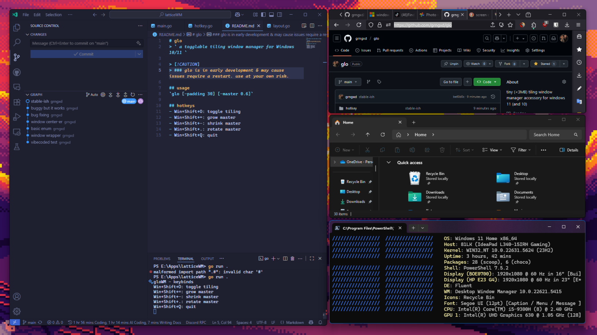

> [!CAUTION]
> ### glo is in early development & may cause issues require a restart. use at your own risk.

    

> ` a togglable tiling window manager for Windows 10/11 `

## usage
`glo [-padding 30] [-master 0.6]`

## hotkeys
- Win+Shift+O: toggle tiling
- Win+Shift+=: grow master
- Win+Shift+-: shrink master
- Win+Shift+.: rotate master
- Win+Shift+Q: quit

## why glo?
glo is designed to be lightweight and efficient, providing a seamless tiling experience on Windows. Its intuitive hotkeys and customizable settings make it easy to adapt to your workflow, while its focus on simplicity ensures that it won't get in your way.
glo was made because of the limitations and complexities of traditional window management on Windows, and the desire for a more streamlined and user-friendly approach. other solutions such as komorebi & glazeWM inspired its development, but glo aims to provide a more native experience for Windows users.